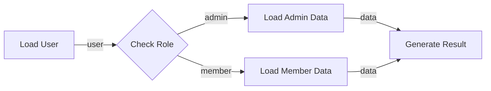

# Node Execution Model

## 1. 文件目的

本文件定義 POC 階段的 Node / Workflow 執行模型，重點聚焦於：

- Node 的 Input / Output 定義
- Node 之間的連線規則
- Output 的 emitted / not emitted 語意
- If / Switch 等分支節點的建模方式
- Downstream Node 的執行條件
- Node lifecycle
- Workflow 與 Function Node 的關係

本設計刻意避免額外引入獨立的 Control Edge，而是讓 **Output 同時承擔資料傳遞與分支啟動的語意**。

---

## 2. 核心抽象

整體模型可類比一般程式語言中的 function composition：

| Workflow 概念 | 程式語言類比 |
|---|---|
| Node | Function |
| Input Port | Function Parameter |
| Output Port | Return Value / Named Result |
| Edge | Argument Binding |
| Workflow | Function Composition |
| Function Node | Reusable Workflow |

例如：

```ts
function calculateOrder(
  user: User,
  cart: Cart,
  discount?: Discount
): OrderResult
```

可以對應為：

```text
Node: Calculate Order

Inputs
 ├─ user     : User
 ├─ cart     : Cart
 └─ discount : Discount?

Outputs
 └─ result   : OrderResult
```

Node 可以有多個 Input Port，也可以有多個 Output Port。

---

## 3. Node 結構

```ts
interface NodeDefinition {
  type: string

  inputs: InputDefinition[]
  outputs: OutputDefinition[]

  execute(
    inputs: Record<string, unknown>,
    context: ExecutionContext
  ): Promise<NodeResult>
}
```

### InputDefinition

```ts
interface InputDefinition {
  name: string
  schema: Schema
  required: boolean
  defaultValue?: unknown
}
```

### OutputDefinition

```ts
interface OutputDefinition {
  name: string
  schema: Schema
}
```

---

## 4. Input Port

每個 Input Port 應視為一個獨立參數。

```text
┌──────────────────────────┐
│ Generate Report          │
│                          │
│ ○ user    : User         │
│ ○ orders  : Order[]      │
│ ○ config  : Config?      │
│                          │
│             Report : ●   │
└──────────────────────────┘
```

對應：

```ts
async function generateReport(
  user: User,
  orders: Order[],
  config?: Config
): Promise<Report>
```

Input Port 可包含：

- `name`
- `schema`
- `required`
- `defaultValue`（optional）

---

## 5. Output Port

Node 可以有一個或多個 Output Port。

但所有 Output **只會在 Node 執行完成時一次性 return**。

執行期間不會向 downstream publish partial output。

```text
READY
  ↓
RUNNING
  ↓
return all outputs
  ↓
COMPLETED
  ↓
Runtime publish outputs
```

因此：

> Output 是 Node execution 的 final result，而不是執行中的 event stream。

---

## 6. Output State

每個 Output Port 必須明確區分：

```ts
type OutputState<T> =
  | {
      status: "emitted"
      value: T
    }
  | {
      status: "not_emitted"
    }
```

### EMITTED

代表此 Output 有正式回傳。

以下全部都屬於合法的 `EMITTED`：

```ts
emit(null)
emit("")
emit([])
emit({})
emit(0)
emit(false)
```

### NOT_EMITTED

代表此次 Node execution 沒有產生此 Output。

```ts
{
  status: "not_emitted"
}
```

---

## 7. Empty Value 與 No Return 必須區分

不能使用 truthy / falsy 來判斷是否有 Output。

錯誤：

```ts
if (output.value) {
  executeNext()
}
```

因為：

```ts
false
0
""
null
[]
{}
```

都可能是合法業務資料。

正確做法：

```ts
if (output.status === "emitted") {
  executeNext()
}
```

---

## 8. NodeResult

Node 在執行結束時一次性回傳所有 Output：

```ts
type NodeResult<TOutputs> = {
  [K in keyof TOutputs]: OutputState<TOutputs[K]>
}
```

例如：

```ts
return {
  success: {
    status: "emitted",
    value: result,
  },

  failed: {
    status: "not_emitted",
  },
}
```

---

## 9. 多 Output 與 Branching

本模型不另外引入：

```text
Data Edge
Control Edge
```

而是統一成：

```text
Output Port → Input Port
```

是否啟動後續分支，由該 Output 是否為 `EMITTED` 決定。

---

## 10. If Node

If Node 可以定義兩個 Output：

```text
                 ┌──────────────┐
input ──────────▶│   If Node    │
                 └──────┬───────┘
                        │
             ┌──────────┴──────────┐
             ▼                     ▼
          true                   false
```

例如：

```ts
return condition
  ? {
      true: {
        status: "emitted",
        value: input,
      },
      false: {
        status: "not_emitted",
      },
    }
  : {
      true: {
        status: "not_emitted",
      },
      false: {
        status: "emitted",
        value: input,
      },
    }
```

因此：

> Branching = 決定哪些 Output 被 emitted。

---

## 11. Switch Node

Switch Node 也是相同模型：

```text
                    ┌─ admin ─────▶ Admin Flow
User ─▶ Switch ─────┼─ member ────▶ Member Flow
                    └─ default ───▶ Guest Flow
```

例如：

```ts
return {
  admin: {
    status: "not_emitted",
  },

  member: {
    status: "emitted",
    value: user,
  },

  default: {
    status: "not_emitted",
  },
}
```

只有 `member` 分支會繼續執行。

---

## 12. Filter Node

Filter 也不需要特殊 execution model。

```text
Input
  item: User

Outputs
  matched   : User
  unmatched : User
```

條件成立：

```ts
return {
  matched: {
    status: "emitted",
    value: user,
  },

  unmatched: {
    status: "not_emitted",
  },
}
```

條件不成立：

```ts
return {
  matched: {
    status: "not_emitted",
  },

  unmatched: {
    status: "emitted",
    value: user,
  },
}
```

---

## 13. Edge

Edge 負責將：

```text
Source Output Port
        ↓
Target Input Port
```

綁定在一起。

例如：

```text
HTTP.output
    │
    ▼
Transform.user
```

Edge 可以抽象為：

```ts
interface Edge {
  sourceNodeId: string
  sourceOutput: string

  targetNodeId: string
  targetInput: string
}
```

---

## 14. Schema Compatibility

Output Port 與 Input Port 連線時必須做 schema compatibility validation。

例如：

```text
CurrentUser
    extends
BaseUser
```

則：

```text
CurrentUser Output
      ↓
BaseUser Input
```

合法。

反向則不一定合法：

```text
BaseUser Output
      ↓
CurrentUser Input

→ Invalid
```

可以將其理解為 function argument assignment compatibility。

---

## 15. Input Runtime State

對 downstream Node 而言，每個 input 在 runtime 可有三種狀態：

```ts
type InputRuntimeState<T> =
  | {
      status: "pending"
    }
  | {
      status: "emitted"
      value: T
    }
  | {
      status: "not_emitted"
    }
```

### PENDING

上游 Node 還沒完成，因此目前不能確定該 input 最終是否會收到資料。

### EMITTED

上游 Node 已完成，並正式產生此 Output。

### NOT_EMITTED

上游 Node 已完成，並明確沒有產生此 Output。

---

## 16. Settled

當 input 進入以下任一狀態：

```text
EMITTED
NOT_EMITTED
```

即視為：

```text
settled
```

`PENDING` 則代表尚未 settled。

---

## 17. Downstream Node 執行條件

假設 Node C：

```text
A.foo ───────▶ C.a
B.bar ───────▶ C.b
```

Node C 的 Inputs：

```text
a : Foo  required
b : Bar  required
```

執行條件：

```text
所有 required inputs 都已 settled
AND
所有 required inputs 都是 EMITTED
```

則執行 Node C。

---

## 18. Skip 條件

若所有 required inputs 已經 settled，但其中任一個：

```text
NOT_EMITTED
```

則 Node 不執行：

```text
Node → SKIPPED
```

例如：

```text
C.a = EMITTED(foo)
C.b = NOT_EMITTED

→ C SKIPPED
```

---

## 19. Pending 狀態不能提前判斷

例如：

```text
C.a = EMITTED(foo)
C.b = PENDING
```

不能執行，也不能 Skip：

```text
→ WAIT
```

因為 B 還沒執行完成。

---

## 20. Empty Value 不影響執行

例如：

```text
C.a = EMITTED(null)
C.b = EMITTED([])
```

依然符合 required input 條件：

```text
→ Execute C
```

因為 Empty Value 與 NOT_EMITTED 是不同語意。

---

## 21. Node Lifecycle

POC 可以先採用：

```text
IDLE
 ↓
READY
 ↓
RUNNING
 ↓
┌────────────┬────────────┐
▼            ▼            ▼
COMPLETED   FAILED       SKIPPED
```

### IDLE

尚未進入執行評估。

### READY

所有 required inputs 已滿足，可開始執行。

### RUNNING

Node 正在執行。

### COMPLETED

Node execute 成功結束，outputs 已 finalized。

### FAILED

Node 執行過程發生錯誤。

### SKIPPED

required input 已確定不可能滿足，因此此次 workflow execution 不執行。

---

## 22. Output Publish Timing

Node execution 期間：

```text
Outputs = internal / unavailable
```

只有：

```text
execute()
完成
```

之後才：

```text
Finalize Outputs
      ↓
Publish Outputs
      ↓
Update Downstream Inputs
```

因此不會出現：

```text
某個 Output 已經有值
但 Node 還沒執行完
```

這種半完成狀態。

---

## 23. 每個 Output 每次 Execution 最多產生一次

POC 建議限制：

> 每個 Node 的每個 Output Port，在單次 execution 中最多產生一次 final result。

即：

```text
Output
 ├─ EMITTED(value)
 └─ NOT_EMITTED
```

不支援：

```text
emit(value1)
emit(value2)
emit(value3)
```

若未來需要多次 emit，代表系統開始進入：

- Streaming
- Event Processing
- Reactive Flow

應另外設計，而不是混入目前的 function-composition execution model。

---

## 24. Workflow

Workflow 是 Node composition：

```text
Input
  ↓
Node A
  ↓
Node B
  ↓
Node C
  ↓
Output
```

也可以包含 branching：

```text
              ┌─▶ Node B ─▶ Node D
Input ─▶ If ──┤
              └─▶ Node C ─▶ Node E
```

---

## 25. Function Node

Function Node 本質上是：

> 被封裝成 reusable unit 的 Workflow。

例如：

```text
Workflow

Input
 ├─ user
 └─ orders

   ↓

Transform

   ↓

Generate Report

   ↓

Output
 └─ report
```

封裝後：

```text
┌──────────────────────────┐
│ GenerateReport Function  │
│                          │
│ ○ user    : User         │
│ ○ orders  : Order[]      │
│                          │
│             Report : ●   │
└──────────────────────────┘
```

在外部看起來與一般 Node 相同。

---

## 26. Function Node 的意義

因此不需要替 Function Node 建立特殊 execution engine。

可以視為：

```text
Function Node
    ↓
Resolve referenced Workflow
    ↓
Execute nested Workflow
    ↓
Map Workflow Outputs
    ↓
Return NodeResult
```

這使得：

```text
Node
Workflow
Function
```

共享同一套 Input / Output contract。

---

## 27. Execution Flow 範例



其中 `Check Role` 執行完成後可能一次 return：

```ts
{
  admin: {
    status: "not_emitted"
  },

  member: {
    status: "emitted",
    value: user
  }
}
```

因此：

```text
Load Admin Data
→ SKIPPED

Load Member Data
→ READY
```

---

## 28. Runtime 核心邏輯

概念性 pseudo code：

```ts
function evaluateNode(node: RuntimeNode) {
  const requiredInputs =
    node.inputs.filter(input => input.required)

  const hasPending =
    requiredInputs.some(
      input => input.state.status === "pending"
    )

  if (hasPending) {
    return
  }

  const hasMissing =
    requiredInputs.some(
      input => input.state.status === "not_emitted"
    )

  if (hasMissing) {
    node.state = "skipped"
    finalizeSkippedOutputs(node)
    return
  }

  node.state = "ready"
  executeNode(node)
}
```

Node 執行：

```ts
async function executeNode(node: RuntimeNode) {
  node.state = "running"

  try {
    const result = await node.definition.execute(
      collectInputs(node),
      createExecutionContext(node)
    )

    finalizeOutputs(node, result)

    node.state = "completed"

    publishOutputs(node)
  } catch (error) {
    node.state = "failed"
  }
}
```

---

## 29. 設計原則摘要

### Node

```text
Inputs  : 0..N
Outputs : 1..N
```

### Input

```text
Input ≈ Function Parameter
```

### Output

```text
Output ≈ Named Return Result
```

### Runtime State

```text
PENDING
EMITTED(value)
NOT_EMITTED
```

其中 `PENDING` 是 runtime 等待狀態。

Node 完成後每個 Output 最終只能是：

```text
EMITTED(value)
NOT_EMITTED
```

### Empty Value

```text
null
""
[]
{}
0
false
```

全部都屬於：

```text
EMITTED
```

### Branching

```text
Branching
=
決定哪些 Output 被 EMITTED
```

### Execution

```text
所有 required input settled
        ↓
全部 EMITTED
        ↓
EXECUTE
```

若：

```text
任一 required input = NOT_EMITTED
```

則：

```text
SKIP
```

### Output Timing

```text
Node RUNNING
→ 不 publish output

Node 完成
→ 一次 return 全部 outputs
→ runtime publish
```

---

## 30. POC 階段建議限制

1. Node 每次 execution 只執行一次。
2. 每個 Output Port 每次 execution 最多產生一個 final result。
3. Node 完成後一次性 return 全部 outputs。
4. 不支援 streaming output。
5. 不支援同一 output 重複 emit。
6. Branching 透過 multi-output + emitted semantics 實現。
7. 不另外建立 Control Edge。
8. Edge 只連接 Output Port → Input Port。
9. Required Input 必須全部 settled 且 emitted 才能執行。
10. Empty Value 與 NOT_EMITTED 必須嚴格區分。

---

## 31. 最終模型

```text
Workflow
   │
   ├── Node
   │    ├── Input Port  0..N
   │    ├── Output Port 1..N
   │    └── execute()
   │
   ├── Edge
   │    └── Output → Input
   │
   └── Function Node
        └── Reusable Workflow
```

Runtime：

```text
Upstream Node
     ↓
RUNNING
     ↓
return Outputs
     ↓
COMPLETED
     ↓
Publish
     ↓
Downstream Input State Update
     ↓
┌────────────────────────────┐
│ Pending?       → WAIT      │
│ Not Emitted?   → SKIP      │
│ All Emitted?   → EXECUTE   │
└────────────────────────────┘
```

這套模型的核心思想是：

> **Workflow 是 function composition，而 branching 是 output emission 的結果。**
